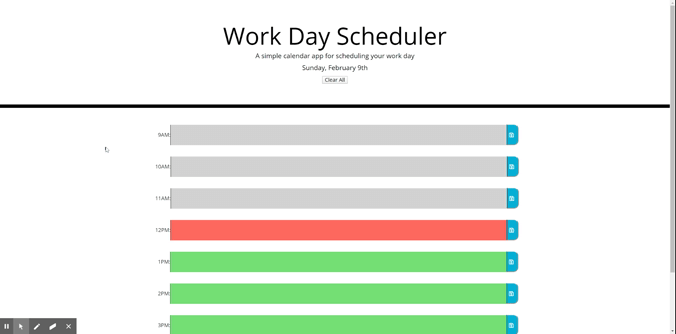

  

  
  
  
  
  

  # Work Day Tracker

  ## Contributors:

  

  Eddy Collado

  * Github Username: :pizza: PhatOrbs

  * Location: Denver, Colorado

  * Email: eddcollado@gmail.com 

  * Bio: Full Stack Web Developer with a bachelors degree in Graphic Design. Strong attributes in all aspects of traditional print and modern digital design.

  ## Description 

  :cake: A simple calender application that allows the user to save events for each hour of the day.

  

  ## Table of Contents 

  * [Installation](#installation) 

  * [Usage](#usage) 

  * [Contributors](#contributors) 

  * [License](#license) 

  * [Tests](#tests) 

  * [Questions](#questions) 

  ## Installation 

  Click the link at the top of the page to start using your daily work tracker. 

  ## Usage 

  :bacon: Using Moment.js, local storage, and jQuery, keeps track of your daily work day schedule. 

  ## License 

  :trophy: n/a 

  ## Credit 

  PhatOrbs 

  ## Contributing 

  :scorpion:  

  ## Tests 

   

  ## Questions 

  What would you like to add to this app? I plan to create light/dark mode toggle as well as a revamp of the styling. 

  :key: :key: :key: :key: :key: 

